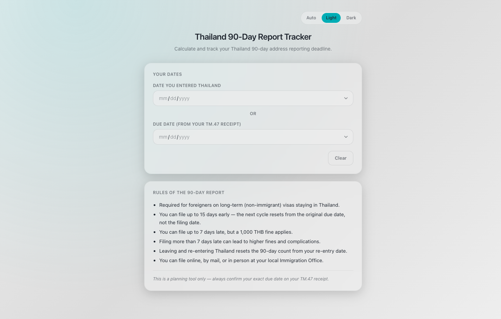
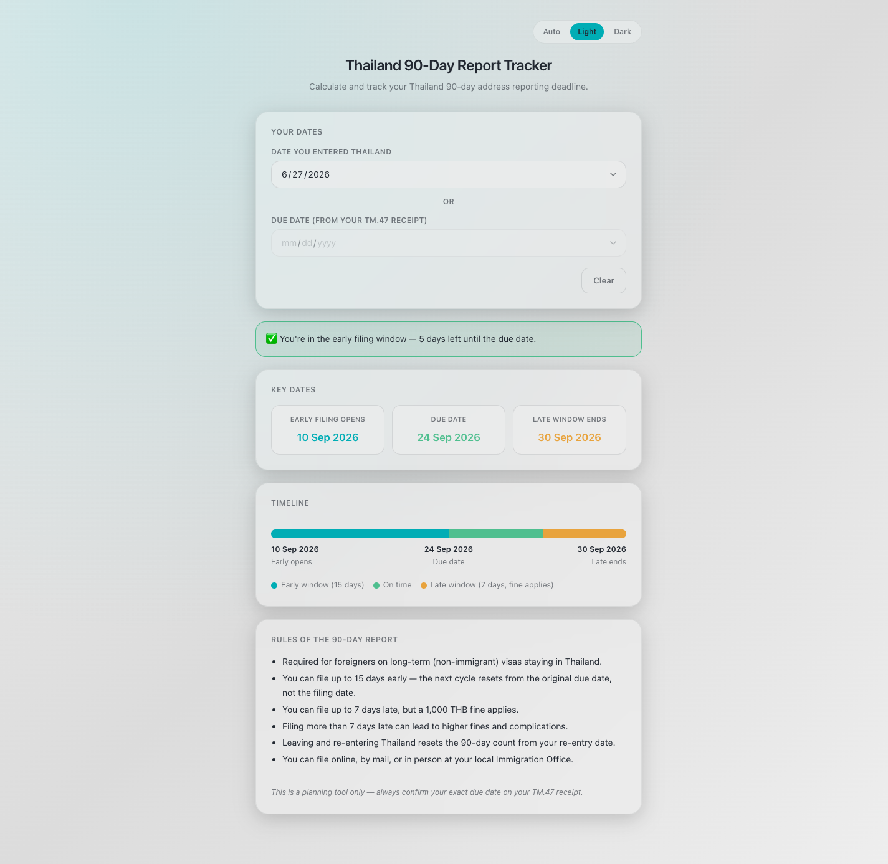
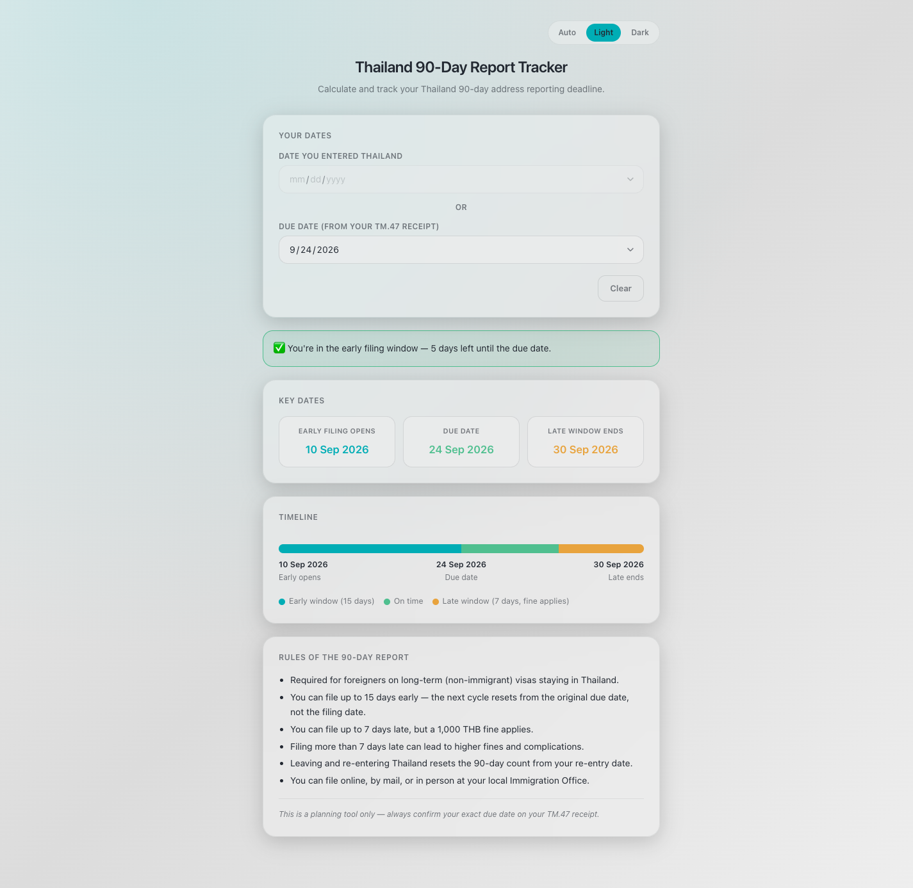

# Thailand 90-Day Report Tracker

A small web app that calculates and tracks your Thailand 90-day address reporting deadline for Thai Immigration.

## What it does

Foreigners staying in Thailand long-term must report their current address to Immigration every 90 days. This tracker takes the guesswork out of that deadline:

- **Due date calculation** — enter the date you last reported (or entered the country), and it works out your next due date. Alternatively, enter a due date directly if Immigration already gave you one.
- **Live status banner** — tells you at a glance whether you're too early to file, safely within the filing window, due today, late (with a fine likely), or overdue and needing to visit Immigration in person.
- **Key dates & timeline** — shows the early filing window, the due date itself, and the late-filing grace period, laid out on a visual timeline.
- **Light/dark theme** — a theme switcher that respects your preference.

All dates are calculated locally in your browser — nothing is sent anywhere or stored.

## Screenshots

**Blank state** — the starting screen before any date is entered.

**Entry date input** — enter the date you last entered Thailand and the app calculates your due date, status, key dates, and timeline.

**Due date input** — already know your due date from your TM.47 receipt? Enter it directly instead.

